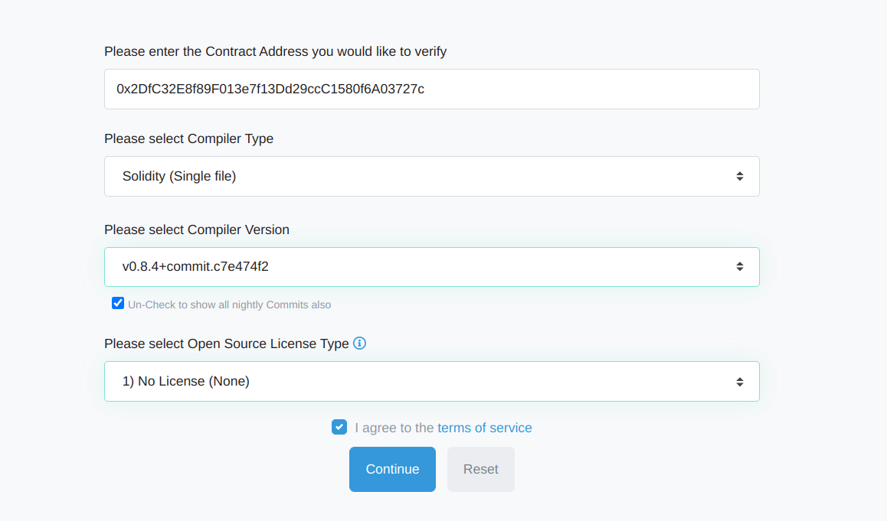
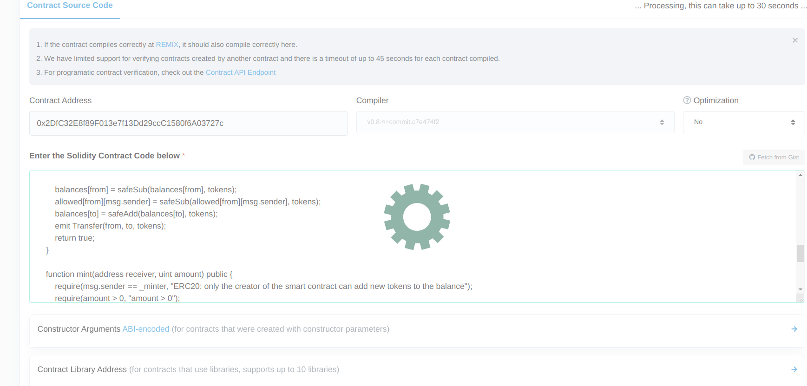
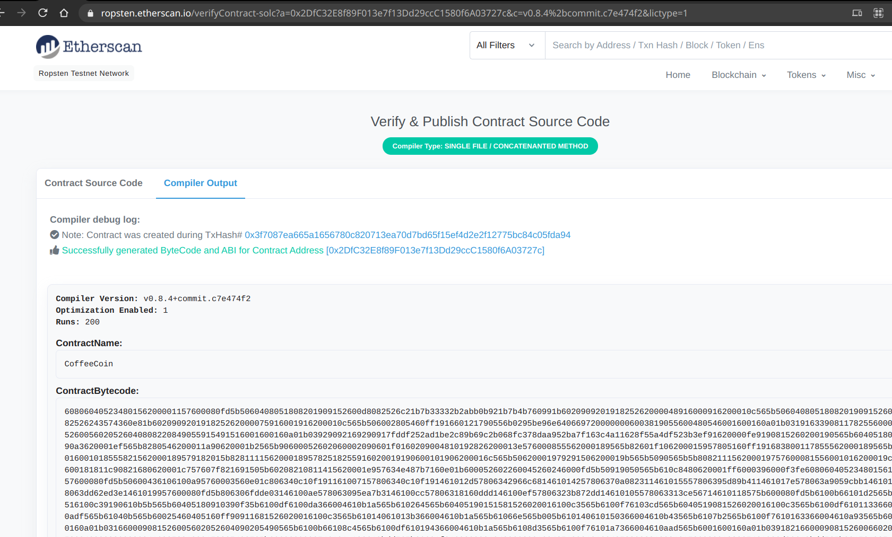

# CoffeeWarCoin
ERC20 Token CoffeeWarCoin Deploy Environment

### 2. Tests Coverage
```
Brownie v1.14.6 - Python development framework for Ethereum

============================= test session starts ==============================
platform linux -- Python 3.7.10, pytest-6.2.3, py-1.10.0, pluggy-0.13.1
rootdir: /home/runner/work/CoffeeWarCoin/CoffeeWarCoin
plugins: eth-brownie-1.14.6, hypothesis-6.10.0, forked-1.3.0, xdist-1.34.0, web3-5.18.0
collected 11 items

Launching 'ganache-cli --port 8545 --gasLimit 12000000 --accounts 10 --hardfork istanbul --mnemonic brownie'...

tests/test_coffeecoin.py ...........                                     [100%]
=================================== Coverage ===================================


  contract: CoffeeCoin - 100.0%
    CoffeeCoin.allowance - 100.0%
    CoffeeCoin.approve - 100.0%
    CoffeeCoin.balanceOf - 100.0%
    CoffeeCoin.burn - 100.0%
    CoffeeCoin.decimals - 100.0%
    CoffeeCoin.mint - 100.0%
    CoffeeCoin.name - 100.0%
    CoffeeCoin.safeAdd - 100.0%
    CoffeeCoin.safeSub - 100.0%
    CoffeeCoin.symbol - 100.0%
    CoffeeCoin.totalSupply - 100.0%
    CoffeeCoin.transfer - 100.0%
    CoffeeCoin.transferFrom - 100.0%

Coverage report saved at /home/runner/work/CoffeeWarCoin/CoffeeWarCoin/reports/coverage.json
View the report using the Brownie GUI
============================== 11 passed in 9.94s ==============================
Terminating local RPC client...

```

### 3. [CI/CD File (Github Actions) with Deploy and Testing](./.github/workflows/ci.yml)

### 4. [Scripts for deploying contract](./scripts/)

### 5. [CI/CD File (Github Actions) with Deploy and Testing](./.github/workflows/ci.yml)

### 6. CoffeeCoin contract address on Ropsten blockchain
```
Running 'scripts/deploy_token.py::main'...
Transaction sent: 0x3f7087ea665a1656780c820713ea70d7bd65f15ef4d2e2f12775bc84c05fda94
  Gas price: 5.0 gwei   Gas limit: 8000000   Nonce: 0
  CoffeeCoin.constructor confirmed - Block: 10285236   Gas used: 888043 (11.10%)
  CoffeeCoin deployed at: 0x2DfC32E8f89F013e7f13Dd29ccC1580f6A03727c
```

### 7. CoffeeCoin check on Ropsten EtherScan




